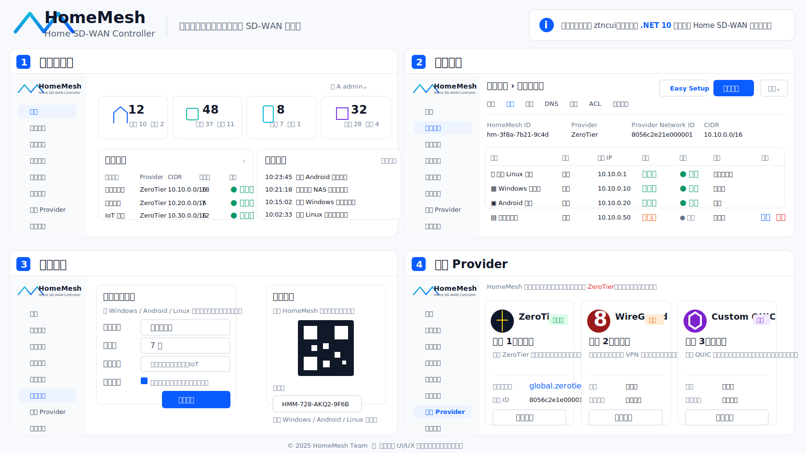

# HomeMesh Client Prototype Notes

本文件用于给客户端实现提供入口信息，尤其适合配合 Codex 继续实现 Windows / Android / Linux / iOS 客户端。

## UI Prototype

管理台原型图已归档：



> 说明：仓库中保存的是压缩预览版 SVG，便于 GitHub 直接预览和文档引用。原始 PNG 原型图可在设计阶段继续保留作为高分辨率版本。

## MVP Client Flow

客户端侧最小闭环建议围绕 `plant-file` 设计：

1. 用户从 `/` 下载网络的 plant 文件。
2. 客户端读取 plant 文件。
3. 客户端识别 Provider：`Demo` / `ZeroTier`。
4. 如果是 ZeroTier，读取 `providerNetworkId` 并调用本机 ZeroTier One 加入网络。
5. 客户端上报设备信息或等待 Controller 从 Provider 同步成员。
6. 管理员在 `/` 同步成员。
7. 如果网络开启自动审核，Controller 自动授权成员。
8. 管理员或 Controller 给设备分配 IP 地址。

## Plant File Shape

当前 MVP plant 文件格式：

```json
{
  "type": "HomeMesh.NetworkJoinFile.v1",
  "networkId": "hmnet_xxx",
  "networkName": "Home Lab",
  "cidr": "10.10.0.0/24",
  "autoApproveMembers": true,
  "provider": "ZeroTier",
  "providerNetworkId": "8056c2e21c000001",
  "generatedAt": "2026-05-18T00:00:00Z"
}
```

## Relevant MVP APIs

```text
GET  /api/auth/status
POST /api/auth/login
GET  /api/networks
GET  /api/networks/{networkId}
GET  /api/networks/{networkId}/plant-file
POST /api/networks/{networkId}/members/sync
PATCH /api/networks/{networkId}/members/{memberId}
POST /api/networks/{networkId}/members/{memberId}/authorize
POST /api/networks/{networkId}/members/{memberId}/deauthorize
```

## Suggested Client Modules

```text
HomeMesh.Client.Core
  PlantFileParser
  NetworkJoinWorkflow
  DeviceIdentityStore
  LocalProviderAdapter

HomeMesh.Client.ZeroTier
  ZeroTierCliAdapter
  ZeroTierLocalApiAdapter

HomeMesh.Client.App
  UI shell
  Login / controller pairing
  Import plant file
  Join network
  Show local join status
```

## Next Client Milestone

建议先做一个最小客户端：

1. 导入 `.plant.json`。
2. 展示网络名、CIDR、Provider、ProviderNetworkId。
3. 如果 Provider 是 `ZeroTier`，调用本机 ZeroTier 加入网络。
4. 显示加入状态。
5. 提示管理员回到 `/` 同步成员、授权、分配 IP。
